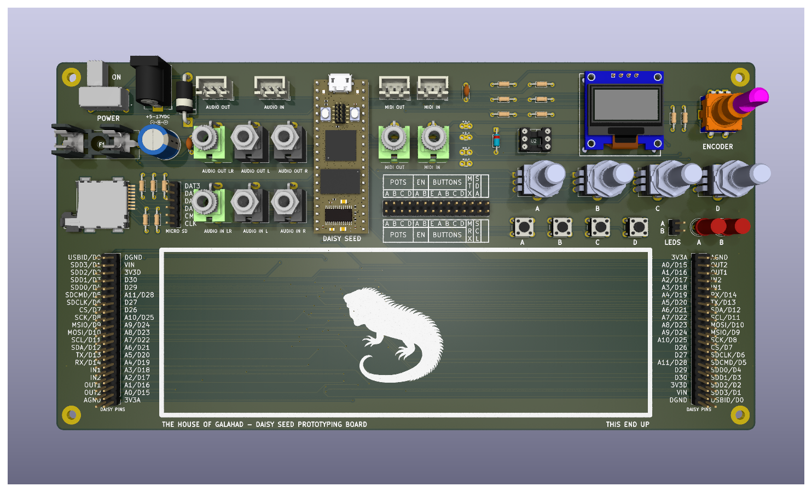

# Prototyping Carrier Board for the Daisy Seed™ 

https://electro-smith.com/products/daisy-seed

This PCB is designed to breakout all the PINs of the Daisy Seed along with additional components such as push buttons, LEDs, potentiometers, I2C, and SD card interfaces along with enough room for a typical 830 point breadboard.  

All 40 Daisy PINs are available on both sides of the board with those on the left being mirrored/inverted for additional flexibility.

[Interactive Bill of Materials (BOM)](https://github.com/Desval27/DaisySeedThingie/blob/main/bom/ibom.html)

## Notes:
- Push buttons are connected on one side to GND to be used with input pullup GPIO pins.
- Potentiomenters are prewired on on the CW & CCW sides to +3V3 and GND.
- Audio in/out jacks are directly connected to the Seed's audio in/out pins.
   If the mono audio in jacks are used left audio in is normalized to right audio in so that they will both be available for processing by the seed if nothing is connected to right audio in.
- JST connectors are provided to breakout the Audio in/out and MIDI in/out signals to external jacks (1/4" Phono, 5-pin DIN, etc.).
- Jumpers are provided to change the configuration between TRS MIDI-A and TRS MIDI-B.  The default configuration is MIDI-A.  If MIDI-B is desired then the jumpers for MIDI-A need to be cut and those for MIDI-B bridged.
 
## Disclaimer

This project is provided "as is", without warranty of any kind, express or implied, 
including but not limited to the warranties of merchantability, fitness for a 
particular purpose, and noninfringement.

Use this design at your own risk. The author assumes no responsibility or liability 
for any damage, injury, or loss resulting from the use of this project, including 
but not limited to hardware damage, data loss, or personal injury.

This project may involve potentially hazardous voltages, currents, or conditions. 
Ensure proper precautions are taken.

